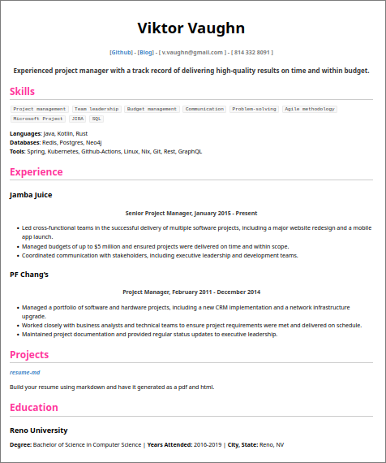

# Resume-md

This project allows you to write and maintain your resume in markdown. GitHub
Actions is used to generate stylized PDF and HTML files based on `resume.md`
and `style.css`. The stylized files are found as outputs in the `Releases`
section, the HTML file is also deployed as a static website using GitHub Pages.

This project is useful for anyone looking to create a professional-looking
resume quickly and easily, and is especially beneficial for those with
technical backgrounds who are familiar with markdown. With this project, you
can focus on the content of your resume rather than worrying about formatting
and deployment.

## Usage

1. Generate a new project using this repository as a template. **Make sure to include all branches!**
2. Enable Read/Write Workflow permissions under `Settings` -> `Actions` for Pages deployment.
3. Edit the `resume.md` file with your resume content using Markdown.
4. Commit and push the changes.
5. Wait for the GitHub Actions to run. This will generate the PDF and HTML files and deploy
the HTML file as a static website.
6. Access the PDF and HTML in the `Releases` section.
7. Access your resume as a static website by going to `https://<your-github-username>.github.io/<repository-name>`.

## GitHub Pages

GitHub Pages is used to deploy the stylized HTML file as a static site. For this to work,
the Workflow Permissions MUST be set to read/write and the repository must be public or
the user a pro user. If you forked this repository or didn't copy the branches during generation,
you will need to point the pages deployment to the `gh-pages` branch under the `Pages` settings.

## Customization

You can customize the stylized PDF and HTML output by editing `style.css`.

### Default Look

## Credits

Originally inspired by [vidluther's project](https://github.com/vidluther/markdown-resume).
